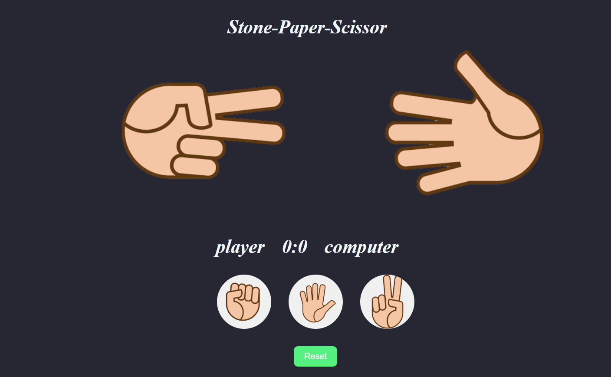

# ✊✋✌️ Stone-Paper-Scissor Game

 
 
 

A fun **Stone-Paper-Scissor** game built using **HTML**, **CSS**, and **JavaScript** where you can play against the computer. 🖥️

---

## 🚀 Live Demo
🔗 [**Play the Game Here**](https://ANAGHA-A-04.github.io/stone-paper-scissors/)  

---

## 📸 Preview

---

## ✨ Features

- Play Stone, Paper, or Scissors against the computer  
- Real-time score tracking for player and computer  
- Clean, user-friendly interface  
- Reset button to start a new game  

---

## 🛠️ Built With
- 🌐 **HTML5** – For structure  
- 🎨 **CSS3** – For styling  
- 🧠 **JavaScript** – For game logic and interactivity  
- 🚀 Deployed on **GitHub Pages**

---

## 📚 What I Learned
- DOM manipulation with JavaScript  
- Handling user input and computer random choices  
- Basic game logic implementation  
- Styling interactive components with CSS  

---

📌 Author
👩‍💻 Anagha A
🌐 GitHub

🏆 Achievements
🎖️ This project was created as part of my JavaScript learning journey.
